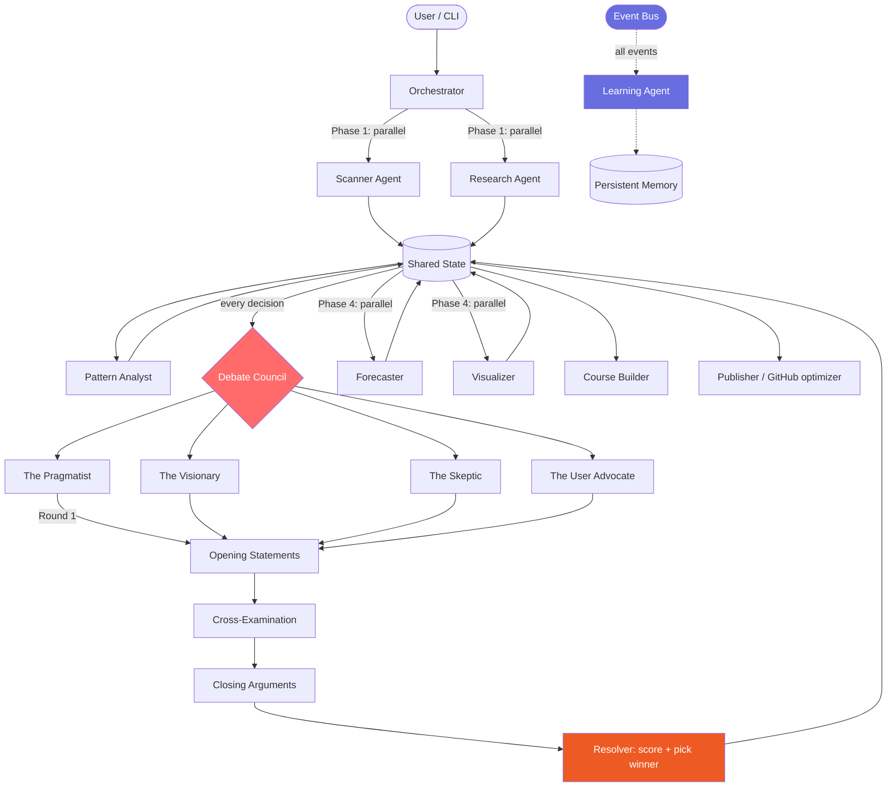

# Crucible

[](https://www.python.org/downloads/)
[](LICENSE)
[](https://pypi.org/project/crucible-ai/)
[](tests/)
[](https://github.com/sboghossian/crucible)

**Most multi-agent frameworks are demos. Crucible is a research instrument.**

Every decision — naming, architecture, prioritization, interpretation — goes through a 4-persona adversarial Debate Council before anything happens. No consensus by default. The best argument wins.

---

## Why Crucible?

Multi-agent AI systems have a sycophancy problem. Agents agree with each other. They share the same model, similar priors, and no mechanism for adversarial challenge. You get fast answers, not rigorous ones.

**The empirical case for adversarial review:**
- METR (2026): developers using AI tools are 19% *slower* while believing they're 20% faster — consensus-based tools optimize for feeling, not accuracy
- Devin achieves 67% PR merge rate on precise tasks but drops to ~15% on ambiguous ones — the failure mode is silent confident-wrong, not loud uncertain
- Sonar (2025): AI coding tools without governance increase code issues 1.7x; *with* governance they decrease 0.3x

Research requires pressure. Metal is tested in a crucible. So are ideas.

---

## Quick Start

Three commands to a working debate:

```bash
pip install crucible-ai
export ANTHROPIC_API_KEY=sk-ant-...
python -c "
import asyncio
from crucible import Orchestrator

async def main():
    orch = Orchestrator()
    result = await orch.standalone_debate(
        topic='Should we migrate to a microservices architecture?',
        options=['yes, now', 'no, stay monolith', 'gradual strangler fig pattern'],
        context='We have 3 engineers and 50k DAU. Our monolith is 4 years old.'
    )
    print(f'Winner: {result.winner} ({result.winner_score:.1f}/10)')
    print(result.decision)
    print(f'Dissent: {result.dissenting_views}')

asyncio.run(main())
"
```

---

## The Debate Council

The crown jewel. Four personas. One topic. Three rounds. The best argument wins.

| Persona | Structural Bias | Weights Highest |
|---|---|---|
| **The Pragmatist** | Implementation feasibility first | Practical feasibility (40%) |
| **The Visionary** | Transformative potential first | Novelty & upside (45%) |
| **The Skeptic** | Evidence quality first | Evidence rigor (45%) |
| **The User Advocate** | Human experience first | Adoption & clarity (35%) |

**Round 1 — Opening Statements:** Each persona presents their position independently (parallel LLM calls, no anchoring).

**Round 2 — Cross-Examination:** Each persona challenges the two weakest arguments from the others.

**Round 3 — Closing Arguments:** Each persona refines their position. Intellectual honesty is rewarded — acknowledging valid challenges is scored higher than repeating Round 1.

**Scoring:** Evidence quality × logical consistency × practical feasibility × novelty. The winner's position becomes the decision. All arguments and scores are logged. Dissent is preserved.

### A Real Debate: Naming This Framework

The Debate Council named Crucible. Here's the abridged transcript:

```
TOPIC: What should this multi-agent research framework be named?
OPTIONS: crucible, forge, tribunal, assay, crucis

[PRAGMATIST — OPENING]
"Crucible wins on implementability: it's memorable, already a common English word
with strong connotations, lowercase-safe as a package name, and not taken on PyPI.
Forge is too generic (already used by multiple projects). Tribunal implies judgment
but not refinement. Assay is too obscure."

[VISIONARY — CROSS-EXAMINATION]
"The Pragmatist focuses only on present-tense naming constraints. The long-term
question is what this name enables — Crucible implies transformation through pressure,
which is exactly what adversarial multi-agent research is. I challenge Assay:
it's scientifically precise but will be mispronounced and misunderstood."

[SKEPTIC — CROSS-EXAMINATION]
"Citing evidence: GitHub repos named after metallurgical processes (forge, anvil, foundry)
have lower star counts than abstract but resonant names. Crucible is the exception
because it has natural language salience. However: is PyPI availability confirmed?
What's the evidence this won't conflict with existing tooling?"

[USER ADVOCATE — CLOSING]
"Closing argument: Crucible. Users searching for 'AI research framework' will
land on a name they can pronounce, remember, and explain to teammates in one sentence:
'It's called Crucible because ideas get tested under pressure.' That sentence writes itself."

WINNER: pragmatist (7.8/10)
DECISION: Crucible — pragmatic, memorable, available, and metaphorically precise.
```

This debate happens for **every decision**: project structure, agent ordering, output formats, KPIs.

---

## Architecture



---

## Feature Highlights

### Debate Council
Four AI personas with structural biases argue adversarially across three rounds. Every decision fork goes through the council. Close margins (< 0.5 score gap) are flagged — genuine uncertainty shouldn't produce false confidence.

### Agent Society (Research Preview)
Persistent agent identities with episodic memory, personality traits (drift capped at 0.02/cycle), and an XP economy where teaching pays 20 XP vs. learning 5 XP. Emergent compression tokens develop between agent pairs. Safety enforced as physics, not policy.

### Learning Agent
A passive observer on the event bus. Distills meta-patterns from all agent outputs. Builds up cross-run institutional knowledge.

### Full Audit Trail
Every agent output, every debate round, every scoring decision is logged and preserved. Dissenting views are not discarded. A close debate (7.1 vs. 6.9) is structurally different from a blowout (9.2 vs. 4.1) — that information is kept.

---

## Agent Reference

| Agent | What it does |
|---|---|
| **Scanner** | Analyzes a git repo: languages, structure, dependencies, git stats, LLM synthesis |
| **Research** | Synthesizes topic knowledge into structured findings with confidence scores |
| **Pattern Analyst** | Finds recurring patterns and anti-patterns across projects |
| **Debate Council** | 4 personas, 3 rounds, adversarial scoring — for every decision |
| **Learning** | Passive observer; distills meta-patterns from all agent outputs |
| **Visualizer** | Generates Mermaid diagrams from findings (architecture, debates, mindmaps) |
| **Forecaster** | Probabilistic predictions with reference classes and disconfirming evidence |
| **Course Builder** | Structures findings into a learning path |
| **Publisher** | GitHub optimization: topics, README hero, release notes |

---

## The `standalone_debate()` Method

Any decision. Any context. Three lines.

```python
from crucible import Orchestrator

orch = Orchestrator()

# Architecture decision
result = await orch.standalone_debate(
    topic="How should we store agent outputs?",
    options=["SQLite", "JSON files", "PostgreSQL", "in-memory only"],
    context="MVP with <100 concurrent runs, need to add persistence later."
)

# Prioritization decision
result = await orch.standalone_debate(
    topic="Which feature should we build next?",
    options=["web UI", "streaming output", "plugin API", "better caching"],
)

print(f"Winner: {result.winner}")
print(f"Score: {result.winner_score:.1f}/10")
print(f"Decision: {result.decision}")
print(f"Dissent: {result.dissenting_views}")
```

---

## Installation

```bash
pip install crucible-ai          # from PyPI
pip install -e ".[dev]"          # development install with test dependencies
```

**Requirements:** Python 3.11+, Anthropic API key

---

## Running Tests

```bash
pytest tests/ -v
pytest tests/test_debate_council.py -v   # just the debate tests
pytest tests/ -m "not api"               # skip tests that make real API calls
```

---

## Configuration

```python
from crucible import Orchestrator

orch = Orchestrator(
    api_key="sk-ant-...",          # or ANTHROPIC_API_KEY env var
    model="claude-opus-4-6",       # orchestrator model
    debate_model="claude-opus-4-6", # debate council model
    max_tokens=4096,
)
```

---

## Research & Documentation

This project is grounded in research produced by the Crucible system itself:

- **[AI-Assisted Development Landscape 2026](docs/research/ai-coding-landscape-2026.md)** — Claude Code leak analysis, vibe coding, tool convergence, SWE-bench contamination, Devin data, multi-agent framework comparison
- **[Forecasts and Scenarios 2027](docs/research/forecast-2027.md)** — METR productivity study, 73% daily adoption, Gartner upskilling forecast, three scenarios with probabilities
- **[Agent Society Specification](docs/architecture/agent-society-spec.md)** — persistent identity, XP economy, personality drift, emergent language, safety-as-physics
- **[Debate Council Deep Dive](docs/architecture/debate-council-deep-dive.md)** — persona specifications, scoring model, real debate examples, anti-patterns

---

## The Course

A 10-module course produced from the research study:

| Module | Title |
|--------|-------|
| 01 | [State of AI-Assisted Development](course/01-state-of-ai-development.md) |
| 02 | [Anatomy of Vibe Coding](course/02-vibe-coding-anatomy.md) |
| 03 | [Multi-Agent Systems: Theory to Practice](course/03-multi-agent-theory.md) |
| 04 | [Building Your First Agent Team with Crucible](course/04-first-agent-team.md) |
| 05 | [The Debate Council Pattern](course/05-debate-council-pattern.md) |
| 06 | [Code Quality in the AI Era](course/06-code-quality-ai-era.md) |
| 07 | [Predictive Analysis](course/07-predictive-analysis.md) |
| 08 | [Building an Agent Society](course/08-agent-society.md) |
| 09 | [Open Source Strategy](course/09-open-source-strategy.md) |
| 10 | [The Developer's Evolving Role](course/10-developers-evolving-role.md) |

---

## Philosophy

Three convictions:

1. **Adversarial review finds what consensus misses.** The best way to stress-test an idea is to have a skeptic, a pragmatist, a visionary, and a user advocate fight over it.

2. **Every decision is a research question.** Naming, architecture, prioritization — these aren't administrative tasks. They're hypotheses. Test them.

3. **Dissent is data.** The losing arguments are logged, not discarded. A close debate (7.1 vs 6.9) is very different from a blowout (9.2 vs 4.1). Both pieces of information matter.

---

## Agent Template Marketplace

65 ready-to-deploy agent team configurations across 18 categories. One command to spin up a full specialist team for any task.

```bash
# Browse all templates
crucible templates

# Filter by category
crucible templates --category "Software Development"

# Search by keyword
crucible templates --search "marketing"

# Preview a deployment plan (no API key needed)
crucible deploy seo_article --plan

# Deploy and run a template
crucible deploy web_app --subject "SaaS project management tool for remote teams"
```

### Content & Marketing

| Template | Agents | What it produces |
|---|---|---|
| `seo_article` | 5 | SEO-optimized article, keyword map, meta tags, editorial review |
| `social_media_campaign` | 4 | 4-week content calendar, platform-native posts, hashtag sets |
| `newsletter` | 4 | Full newsletter issue, 8 subject line variants, HTML structure guide |

### Software Development

| Template | Agents | What it produces |
|---|---|---|
| `web_app` | 5 | Architecture doc, project scaffold, CI/CD YAML, testing strategy |
| `mobile_app` | 4 | Platform decision, UX flows, API design, app store checklist |
| `api_service` | 4 | OpenAPI 3.1 spec, implementation guide, security audit |
| `chrome_extension` | 4 | Manifest V3, popup/service worker scaffold, store listing |

### Research & Analysis

| Template | Agents | What it produces |
|---|---|---|
| `market_research` | 4 | TAM/SAM/SOM, competitive landscape, buyer personas |
| `codebase_audit` | 4 | Security audit, tech debt inventory, 90-day improvement roadmap |
| `academic_paper` | 4 | Full paper draft, peer review simulation, citation list |

### Business Operations

| Template | Agents | What it produces |
|---|---|---|
| `startup_pitch` | 4 | Pitch deck outline, financial projections, investor one-pager |
| `product_spec` | 4 | PRD, user stories with acceptance criteria, MVP definition |
| `legal_review` | 4 | Risk assessment, negotiation agenda, contract clause alternatives |

### Creative

| Template | Agents | What it produces |
|---|---|---|
| `video_script` | 4 | Complete script, storyboard, shot list, YouTube SEO package |
| `course_creator` | 4 | Course outline, 3 sample lessons, quizzes, capstone rubric |
| `game_design` | 4 | GDD, core loop design, narrative, monetization model |

### Education

| Template | Agents | What it produces |
|---|---|---|
| `lesson_plan` | 4 | Standards-aligned lesson with differentiation strategies |
| `tutoring_session` | 4 | Diagnostic quiz, 60-min session plan, 10 practice problems |
| `exam_prep` | 4 | Study schedule, 20 practice questions, test-taking strategy |
| `curriculum_design` | 4 | Scope and sequence, curriculum map, assessment framework |
| `research_paper_review` | 4 | Methodology critique, statistical audit, plain-language summary |

### E-commerce

| Template | Agents | What it produces |
|---|---|---|
| `product_listing_optimizer` | 4 | Optimized title/bullets/description, image strategy, review emails |
| `competitor_pricing` | 4 | Price distribution analysis, promotions calendar, margin model |
| `customer_review_analysis` | 4 | Sentiment report, theme extraction, product improvement priorities |
| `inventory_forecaster` | 4 | 12-month forecast, reorder points, supply chain strategy |

### Healthcare & Wellness

| Template | Agents | What it produces |
|---|---|---|
| `wellness_plan` | 4 | Nutrition plan, workout schedule, 90-day habit roadmap |
| `patient_intake_summarizer` | 4 | Structured HPI, medication reconciliation, visit summary |
| `symptom_checker_research` | 4 | Educational symptom profile, doctor visit preparation guide |

### Real Estate

| Template | Agents | What it produces |
|---|---|---|
| `property_analysis` | 4 | Pro forma, 5-year IRR, due diligence checklist, hold strategy |
| `market_comparison` | 4 | Weighted scoring matrix, investment return comparison |
| `listing_generator` | 4 | MLS copy, photography shot list, 30-day marketing launch plan |

### Finance

| Template | Agents | What it produces |
|---|---|---|
| `financial_model` | 4 | 3-statement model, scenario analysis, break-even analysis |
| `investment_thesis` | 4 | Bull/bear case, DCF valuation, entry/exit criteria |
| `budget_planner` | 4 | Expense audit, savings architecture, 90-day action plan |
| `tax_prep_organizer` | 4 | Document checklist, deduction research, professional meeting prep |

### HR & Recruiting

| Template | Agents | What it produces |
|---|---|---|
| `job_description_writer` | 4 | Bias-audited JD, employer brand copy, distribution strategy |
| `resume_screener` | 4 | Scorecard with rubric, calibration guide, bias interrupter checklist |
| `interview_prep` | 4 | 12 STAR stories, technical prep, salary negotiation script |
| `onboarding_plan` | 4 | Day 1 schedule, 90-day learning plan, success criteria |

### DevOps & Infrastructure

| Template | Agents | What it produces |
|---|---|---|
| `incident_postmortem` | 4 | Timeline reconstruction, 5-Whys RCA, blameless report |
| `capacity_planning` | 4 | 12-month forecast, auto-scaling policies, cost optimization roadmap |
| `migration_planner` | 4 | Migration strategy, risk matrix, rollback plan per phase |
| `monitoring_setup` | 4 | SLI/SLO definitions, alert taxonomy, 4 dashboard specs |

### Data Science

| Template | Agents | What it produces |
|---|---|---|
| `dataset_explorer` | 4 | EDA report, 10 analytical hypotheses, Python code outline |
| `ml_pipeline` | 4 | Feature engineering plan, algorithm selection, MLOps architecture |
| `ab_test_analyzer` | 4 | Power analysis, statistical test selection, ship/no-ship framework |
| `dashboard_builder` | 4 | KPI hierarchy, data model, wireframes, adoption plan |

### Legal

| Template | Agents | What it produces |
|---|---|---|
| `patent_analysis` | 4 | Patent landscape, FTO risk tiers, filing strategy |
| `compliance_audit` | 4 | Gap analysis, evidence collection playbook, remediation roadmap |
| `terms_of_service_generator` | 4 | ToS + Privacy Policy + Cookie Policy drafts |
| `gdpr_assessment` | 4 | ROPA template, lawful basis audit, breach notification procedure |

### Sales

| Template | Agents | What it produces |
|---|---|---|
| `cold_outreach_sequence` | 4 | 5-touch email sequence, LinkedIn strategy, cold call scripts |
| `deal_qualification` | 4 | MEDDIC assessment, pursuit recommendation, 30-day validation plan |
| `proposal_generator` | 4 | Full proposal, ROI model, competitive battle cards |
| `win_loss_analysis` | 4 | Interview guides, pattern analysis, competitive battle cards |

### Customer Success

| Template | Agents | What it produces |
|---|---|---|
| `churn_predictor` | 4 | Health score formula, intervention playbooks, win-back sequence |
| `qbr_prep` | 4 | QBR agenda, ROI narrative, expansion opportunity plan |
| `feature_request_aggregator` | 4 | RICE-scored feature inventory, product team briefing memo |
| `onboarding_playbook` | 4 | Journey map, kickoff agenda, health metrics, email sequence |

### Personal Productivity

| Template | Agents | What it produces |
|---|---|---|
| `weekly_planner` | 4 | Weekly review, time-blocked schedule, obstacle if-then plans |
| `meeting_prep` | 4 | Stakeholder profiles, key messages, follow-up email template |
| `goal_tracker` | 4 | OKR framework, milestone map, accountability system |
| `habit_builder` | 4 | Habit design, implementation intentions, recovery protocol |

### Media & Journalism

| Template | Agents | What it produces |
|---|---|---|
| `investigative_research` | 4 | Story hypothesis, source map, publication strategy |
| `fact_checker` | 4 | Claim extraction, accuracy ratings, editor briefing memo |
| `story_pitch` | 4 | 300-word pitch email, logline, editor objection responses |

### Python API

```python
from crucible.templates import registry

# List everything
for template in registry.list_templates():
    print(f"{template.name}: {template.description}")

# Deploy a template
session = registry.deploy_template(
    "seo_article",
    api_key="sk-ant-...",
)

# Preview the plan without running
print(session.plan())

# Run the full agent team
results = await session.run(subject="Best practices for REST API design in 2026")

# Results keyed by agent name
for agent_name, data in results.items():
    print(f"{agent_name}: {data['output'][:200]}")
```

---

## Roadmap

Full details in [docs/ROADMAP.md](docs/ROADMAP.md).

### Phase 1 — Real-Time Experience (v0.2)

- [ ] **Streaming output** — watch debates unfold token-by-token in real-time
- [ ] **Web UI** — visual debate transcript viewer with timeline, persona highlights, scoring visualization
- [ ] **Debate replay and branching** — rewind to any decision point, fork with different personas or prompts

### Phase 2 — Extensibility (v0.3)

- [ ] **Plugin API** — register custom agents with a simple decorator, hot-reload during runs
- [ ] **Custom persona definitions** — YAML/JSON persona configs so anyone can define new debate participants
- [ ] **Template composer** — combine multiple templates into multi-stage pipelines (e.g., "Research → Spec → Build → Test")
- [ ] **Template versioning and community submissions** — semantic versioning, PR-based submission flow, quality gates

### Phase 3 — Intelligence (v0.4)

- [ ] **Live web search integration** — agents can pull real-time data during debates and research
- [ ] **SQLite memory persistence across runs** — every debate, decision, and learning persists locally
- [ ] **Agent Society Phase 2** — persistent identity, XP economy, emergent language, personality drift (full spec in [docs/architecture/agent-society-spec.md](docs/architecture/agent-society-spec.md))

---

## Contributing

Read [CONTRIBUTING.md](CONTRIBUTING.md) before opening a PR. The short version: open an issue first for anything non-trivial, write tests before marking complete, one thing per PR.

Real-world debate transcripts that produced wrong results are among the most valuable contributions. If the Debate Council got it wrong, that's a bug.

---

## License

MIT — see [LICENSE](LICENSE)
